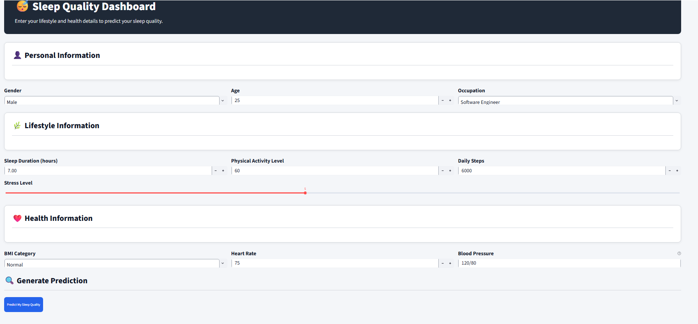
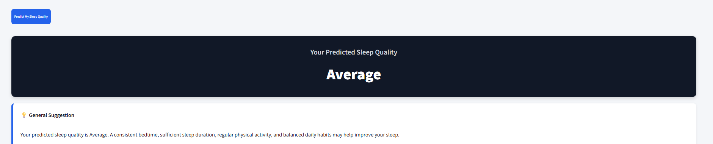

````markdown
# 😴 Sleep Quality Prediction Using Lifestyle Factors

A machine learning web application that predicts **sleep quality** using lifestyle and health-related factors such as sleep duration, stress level, physical activity, heart rate, and daily steps.

The application compares predictions from **Logistic Regression** and **Random Forest Classifier** through an interactive **Streamlit** interface.

> **Disclaimer:** This project is intended for educational and demonstration purposes only. The predicted sleep-quality categories are project-defined and are **not medical classifications, diagnoses, or treatment recommendations**.

---

## 📌 Project Overview

Sleep quality can be influenced by a combination of lifestyle, behavioral, and health-related factors. This project uses supervised machine learning to classify sleep quality into three project-defined categories:

| Category | Original Sleep Quality Score |
|----------|------------------------------|
| 🔴 **Poor** | 4–6 |
| 🟡 **Average** | 7–8 |
| 🟢 **Good** | 9 |

Users enter their personal, lifestyle, and health information through a Streamlit web interface. The application processes the input and generates predictions using two machine learning models:

- **Logistic Regression**
- **Random Forest Classifier**

The predictions from both models are displayed so users can compare their results.

---

## ✨ Features

- 🛌 Predict sleep quality using lifestyle and health-related inputs
- 🤖 Logistic Regression classification
- 🌲 Random Forest classification
- 📊 Compare predictions from both models
- 🌐 Interactive Streamlit web application
- ✅ Blood pressure input validation
- ⚠️ Input range validation
- 📈 Model evaluation using accuracy, precision, recall, and F1-score
- 🔄 Five-fold cross-validation
- 💡 General sleep improvement suggestions
- 💾 Save and load trained machine learning models
- 📊 Data preprocessing and visualization

---

## 🛠️ Tech Stack

| Technology | Purpose |
|------------|---------|
| **Python** | Core programming language |
| **Pandas** | Data processing and manipulation |
| **NumPy** | Numerical operations |
| **Scikit-learn** | Machine learning and model evaluation |
| **Streamlit** | Interactive web application |
| **Matplotlib** | Data visualization |
| **Seaborn** | Statistical visualization |
| **Joblib** | Saving and loading trained models |

---

## 📊 Dataset

### Sleep Health and Lifestyle Dataset

The project uses the **Sleep Health and Lifestyle Dataset**, which contains lifestyle and health-related information associated with sleep quality.

The dataset contains **374 records** and includes the following features:

- Gender
- Age
- Occupation
- Sleep Duration
- Quality of Sleep
- Physical Activity Level
- Stress Level
- BMI Category
- Blood Pressure
- Heart Rate
- Daily Steps

### Target Variable

The original `Quality of Sleep` score is converted into three project-defined categories:

```text
4–6  → Poor
7–8  → Average
9    → Good
````

> **Note:** These categories are created specifically for this project and should not be interpreted as official medical or clinical classifications.

---

## 📋 Input Features

The application accepts the following inputs:

| Feature                     | Description                                   |
| --------------------------- | --------------------------------------------- |
| **Gender**                  | User's gender                                 |
| **Age**                     | User's age                                    |
| **Occupation**              | User's occupation                             |
| **Sleep Duration**          | Average daily sleep duration                  |
| **Physical Activity Level** | Daily physical activity level                 |
| **Stress Level**            | Reported stress level                         |
| **BMI Category**            | BMI classification                            |
| **Blood Pressure**          | Blood pressure in `systolic/diastolic` format |
| **Heart Rate**              | Resting heart rate                            |
| **Daily Steps**             | Average number of daily steps                 |

### Blood Pressure Format

Blood pressure should be entered in the following format:

```text
120/80
```

The application validates the blood pressure format before making a prediction.

---

## 🤖 Machine Learning Models

The project trains and compares two supervised classification algorithms.

### 1. Logistic Regression

Logistic Regression is used as a baseline classification algorithm. It provides a simple and interpretable approach for predicting the three sleep-quality categories.

### 2. Random Forest Classifier

Random Forest is an ensemble learning algorithm that combines multiple decision trees to improve classification performance and capture nonlinear relationships between features.

---

## ⚙️ Machine Learning Pipeline

The project follows the following machine learning workflow:

```text
Raw Dataset
     |
     v
Data Cleaning
     |
     v
Target Category Creation
     |
     v
Feature Selection
     |
     v
Numerical Scaling
     |
     v
Categorical Encoding
     |
     v
Stratified Train/Test Split
     |
     +-----------------------+
     |                       |
     v                       v
Logistic Regression    Random Forest
     |                       |
     +-----------+-----------+
                 |
                 v
          Model Evaluation
                 |
                 v
        Save Trained Models
                 |
                 v
        Streamlit Application
                 |
                 v
           User Prediction
```

### Preprocessing

The project uses the following preprocessing techniques:

* Numerical feature scaling
* Categorical feature encoding
* Train-test splitting
* Stratified sampling
* Five-fold cross-validation

---

## 📈 Model Evaluation

The models are evaluated using:

* Accuracy
* Precision
* Recall
* F1-score
* Confusion Matrix
* Five-fold Cross-Validation

### Cross-Validation Results

| Model               | Mean Five-Fold Cross-Validation Accuracy |
| ------------------- | ---------------------------------------- |
| Logistic Regression | **95.43%**                               |
| Random Forest       | **95.71%**                               |

Based on the reported five-fold cross-validation results, both models achieve high accuracy on this dataset, with **Random Forest performing slightly better**.

> **Note:** High performance on this dataset does not necessarily mean that the models will achieve the same performance on new populations or real-world data.

---

## 🔄 Project Workflow

```text
Lifestyle & Health Inputs
          |
          v
 Streamlit Web Interface
          |
          v
    Input Validation
          |
          v
  Data Preprocessing
          |
     +----+----+
     |         |
     v         v
Logistic    Random
Regression  Forest
     |         |
     +----+----+
          |
          v
 Predicted Sleep Quality
          |
          v
General Sleep Suggestions
```

---

## 🖥️ Application Screenshots

### User Input Form



### Prediction Results



---

## 📂 Project Structure

```text
sleep-quality-prediction/
│
├── data/
│   ├── Sleep_Health_and_Lifestyle_Dataset.csv
│   └── prepared_sleep_data.csv
│
├── screenshots/
│   ├── input.png
│   └── result.png
│
├── .venv/
│
├── inspect_data.py
├── eda.py
├── prepare_data.py
├── train_model.py
├── validate_model.py
├── app.py
│
├── logistic_model.pkl
├── random_forest_model.pkl
│
├── requirements.txt
└── README.md
```

---

## 🚀 How to Run the Project

### 1. Open the Project

Open the `sleep-quality-prediction` folder in **Visual Studio Code**.

Open the VS Code terminal and move into the project folder:

```bash
cd sleep-quality-prediction
```

---

### 2. Create a Virtual Environment

```bash
python -m venv .venv
```

---

### 3. Activate the Virtual Environment

#### Windows

```bash
.venv\Scripts\activate
```

#### macOS/Linux

```bash
source .venv/bin/activate
```

After activation, the terminal should display:

```text
(.venv)
```

---

### 4. Install Dependencies

Install the required Python packages:

```bash
pip install -r requirements.txt
```

---

### 5. Prepare the Dataset

Run:

```bash
python prepare_data.py
```

This command:

* Loads the original dataset
* Removes unnecessary columns
* Creates the sleep quality categories
* Saves the prepared dataset

The prepared dataset is saved as:

```text
data/prepared_sleep_data.csv
```

---

### 6. Train the Models

Run:

```bash
python train_model.py
```

This command:

* Loads the prepared dataset
* Separates input features and target values
* Preprocesses numerical and categorical features
* Performs a stratified train-test split
* Trains Logistic Regression
* Trains Random Forest
* Calculates model accuracy
* Displays classification reports
* Displays confusion matrices
* Performs five-fold cross-validation
* Saves the trained models

The following files are generated:

```text
logistic_model.pkl
random_forest_model.pkl
```

---

### 7. Launch the Streamlit Application

Run:

```bash
streamlit run app.py
```

The Streamlit application will open in your browser.

If it does not open automatically, visit:

```text
http://localhost:8501
```

---

## 🖥️ How to Use the Application

1. Open the Streamlit application.
2. Enter your personal information.
3. Enter lifestyle details.
4. Enter health-related information.
5. Enter blood pressure in `120/80` format.
6. Click **Predict Sleep Quality**.
7. View the **Logistic Regression** prediction.
8. View the **Random Forest** prediction.
9. Compare the predictions from both models.
10. Read the general sleep improvement suggestions.

The predicted category will be one of:

* 🔴 **Poor**
* 🟡 **Average**
* 🟢 **Good**

---

## 🧪 Additional Scripts

### Exploratory Data Analysis

Run:

```bash
python eda.py
```

This script can be used to explore the dataset and generate visualizations.

### Inspect Dataset

Run:

```bash
python inspect_data.py
```

This script can be used to inspect the dataset structure and available features.

### Validate Models

Run:

```bash
python validate_model.py
```

This script can be used for additional model validation.

---

## 🔮 Future Enhancements

* 📊 Add interactive analytical dashboards
* 📈 Display model evaluation metrics inside the application
* 💾 Save prediction history
* 📄 Export prediction reports as PDF
* 🌍 Add a multilingual interface
* 🧠 Train models using larger and more diverse datasets
* 🔍 Add feature importance visualizations
* 🎯 Display prediction probabilities
* ☁️ Deploy the application online
* 💡 Provide more personalized sleep recommendations
* 📱 Improve the interface for mobile devices

---

## ⚠️ Limitations

* The dataset contains only **374 records**.
* The dataset may not represent the entire population.
* The target categories are project-defined.
* The model uses only the available dataset features.
* Real-world sleep quality depends on many additional factors.
* High accuracy may be influenced by strong relationships between the available features and the target variable.
* The model has not been developed or validated as a clinical prediction system.
* The application cannot provide medical diagnoses.
* Predictions should not replace professional medical advice.

---

## ⚕️ Disclaimer

This project is developed for **educational and demonstration purposes only**.

The predictions generated by this application are **not medical advice** and should not be considered a medical diagnosis or treatment recommendation.

Users with health-related concerns should consult a qualified healthcare professional.

---

## 👩‍💻 Author

### Varshini Samireddi

**GitHub:**
https://github.com/varshinisamireddi114

**LinkedIn:**
https://www.linkedin.com/in/varshini-samireddi-21623832a

---

## ⭐ Support

If you found this project useful, consider giving the repository a ⭐ on GitHub!

Feedback and suggestions are welcome.

````

